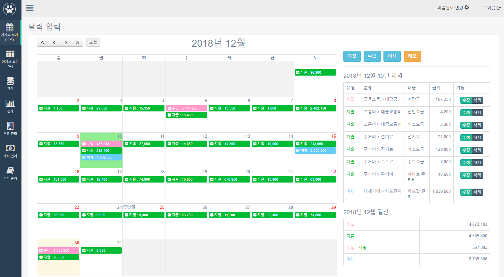
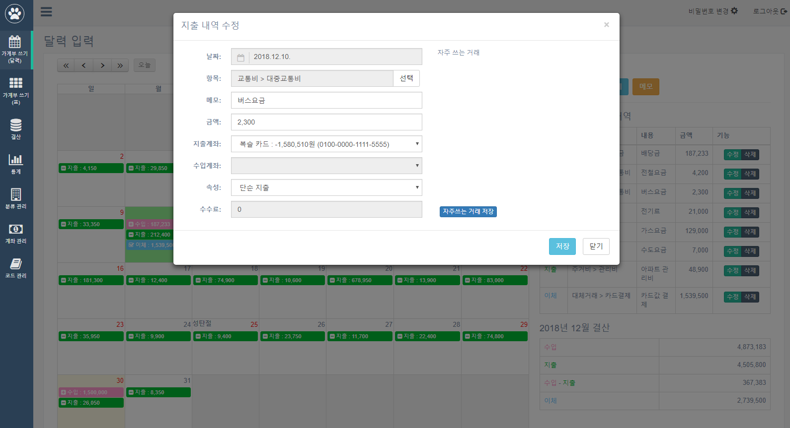
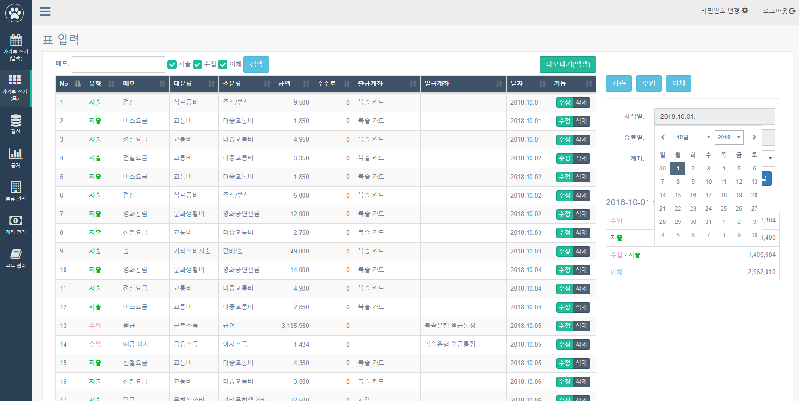
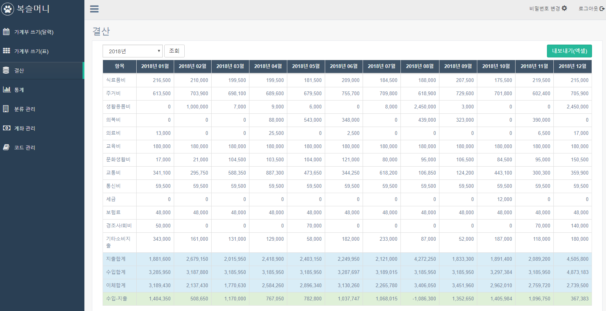
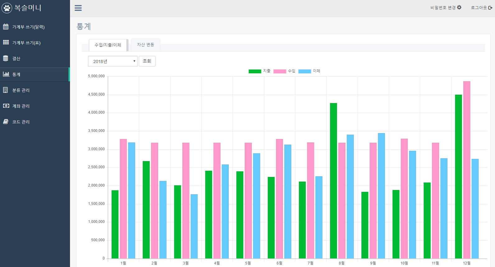
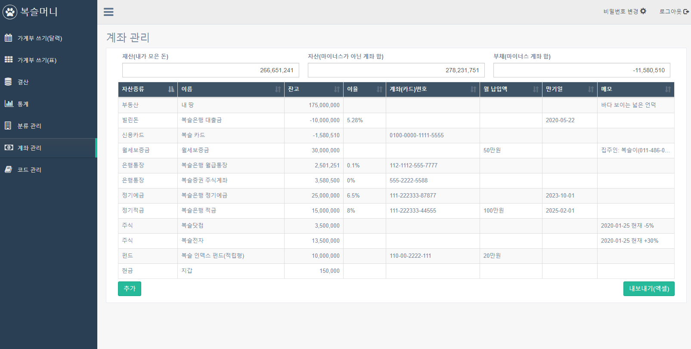

복슬머니 
==================================================

개인용 가계부 입니다. 
현재 버전: 0.0.1 
 
### 주요기능
* 계좌(통장, 카드, 주식 등) 등록 및 관리
* 달력 및 목록 방식 조회
* 자주쓰는 거래 내역 등록
* 년단위 기준 월 결산 
* 결과 목록 엑셀 내보내기
* 분류 및 각종 코드관리
* 수입/지출/이체 내역 및 자산 변동 통계

### 빌드 방법
* `maven clean`
* `maven install`
* 빌드 결과: bokslmoney-0.0.1.war

### 실행방법
* `java -jar bokslmoney-0.0.1.war`

### 주요 프레임워크 및 라이브러리
* Spring Boot: 2.0.5
* JPA
* H2 Database
* lombok
* [UI 템플릿 - gentelella](https://github.com/puikinsh/gentelella)
* Vue.js
* Jquery 
* Jquery-ui
* jquery.twbsPagination
* vee-validate
* moment.js
* js-xlsx-master
* bootstrap
* daterangepicker
* fullcalendar 
* icheck
* moment-lunar
* jquery.contextMenu
* datatables.js
* jszip
* Chart.js
* lodash

### 주요 화면
* 달력 보기

* 지출 입력

* 목록 보기

* 결산 내역

* 수입/지출/이체 그래프

* 계좌 목록
